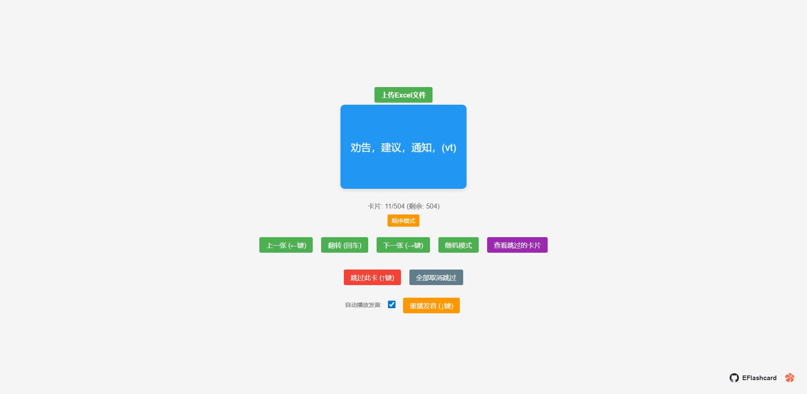

# EFlashcard

一个纯html简单的闪卡练习，使用excel存储单词。

测试使用闪卡.xlsx

> 我没想到确实还是有人用的！
> 我推荐使用： [Qwerty Learner](https://github.com/RealKai42/qwerty-learner)
> 我现在是不知道需求是什么，就不知道如何去改！

1. 添加词库导入，我估计有人使用是还是英文背单词。词汇需要自己做，如果是通用的可以去在Qwerty Learner上面找，在public/dicts 里面很多json。
2. 如果是自定义，我重新写个结构，我不是很会GitHub自动化，但是可以尝试下。
   1. 例如：写一个列表.json，引用所有的excel文件，如果是自动化，只需要上传excel，会自动生成列表.json。

## 快捷键

← 上一张
→ 下一张
enter回车 翻转
↑ 跳过（用于已经学好。）
↓ 重播发音

## 开启窗口模式

1. 在游览器输入 edge://apps/
2. 打开左边 在工具条上显示应用程序按钮
3. 打开网站：https://iiistudio.github.io/EFlashcard/
4. 在头像旁边有个应用按键，点击安装

这样就有个很小的窗口操作了。

## 更新日志

### v1.0.3 - 2025年10月2日

#### 新增
- 新增了 专注模式

### v1.0.2 - 2025年10月1日

#### 新增
- 新增了 自动播放卡片功能。

#### 变更
- 优化了 开关样式

## 图片

好久远！
